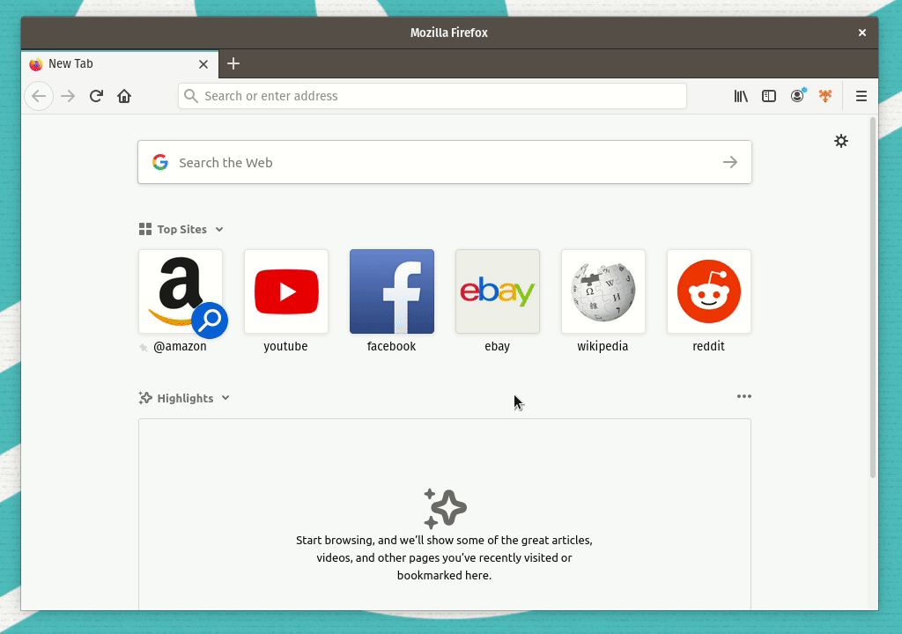

# Firefox Zen Mode

## A Firefox web extension that toggles the browser UI

### Installation

NOTE: This extension only works with Firefox nightly / beta / dev edition

1. Clone the respository
2. Run `yarn build`
3. Set `extensions.legacy.enabled=true` `extensions.experiments.enabled=true` `xpinstall.signatures.required=false` in `about:config`
4. Install the zip file in `about:addons`

### How to use

Click the toolbar icon to hide the UI or press `Ctrl+F11` to toggle it.
